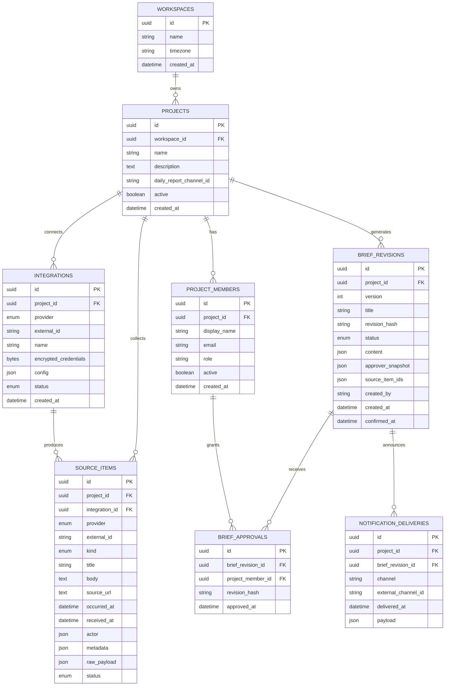

# TeamPulse ERD

## Important Constraints

- `project_members(project_id, email)` is unique.
- `integrations(project_id, provider, external_id)` is unique.
- `source_items(provider, external_id)` is unique to avoid duplicate webhook/polling deliveries.
- `brief_revisions(project_id, revision_hash)` is unique.
- `brief_approvals(brief_revision_id, project_member_id)` is unique.
- `notification_deliveries(project_id, brief_revision_id, channel)` prevents repeated daily reminders for the same revision/channel.

## Approval Snapshot

`brief_revisions.approver_snapshot` stores the required member set at creation time. This prevents a revision's approval target from silently changing after a member is added or removed. A blocked revision should be superseded by a new revision after explicit admin action.
